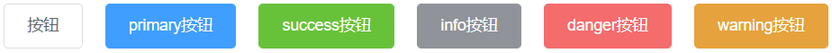
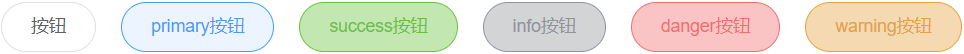

## 一、封装一个Button按钮

### 1.需要考虑的问题：

- 组件通讯
- 组件插槽
- props校验

参数的支持：

| 参数名  | 参数描述                                        | 参数类型 | 默认值  |
| ------- | ----------------------------------------------- | -------- | ------- |
| type    | 按钮类型（primary/success/warning/danger/info） | string   | default |
| round   | 是否是圆角按钮                                  | boolean  | false   |
| circle  | 是否是圆形按钮                                  | boolean  | false   |
| disable | 是否禁用按钮                                    | boolean  | false   |

事件支持：

| 事件名 | 事件描述 |
| ------ | -------- |
| click  | 点击事件 |

简单来说，凡是希望组件中内容可以灵活设置的地方，都需要用到slot插槽来自定义内容。

使用slot来定义按钮上的文本内容：

<template>
  <button class="one-button">
   <span><slot></slot></span>
  </button>
</template>
在使用时就可以直接输入文本，定义按钮文本内容了：

<template>
  <div>
    <one-button>登录</one-button>
    <one-button>删除</one-button>
    <one-button>取消</one-button>
  </div>
</template>
### 2.button组件的基本样式：

```css
// style/button.less
  .one-button{
    display: inline-block;
    line-height: 1;
    white-space: nowrap;
    cursor: pointer;
    background: #ffffff;
    border: 1px solid #dcdfe6;
    color: #606266;
    -webkit-appearance: none;
    text-align: center;
    box-sizing: border-box;
    outline: none;
    margin: 0;
    transition: 0.1s;
    font-weight: 500;
    //禁止元素的文字被选中
    user-select: none;
    -moz-user-select: none;
    -webkit-user-select: none;
    -moz-user-select: none;
    -ms-user-select: none;
    padding: 12px 20px;
    font-size: 14px;
    border-radius: 4px;
    &:hover,
    &:hover{
      color: #409eff;
      border-color: #c6e2ff;
      background-color: #ecf5ff;
    }
  }
```

### 3.1`type`属性

type的可选值：` primary `、` success`、 ` info ` 、`danger `、` warning `、`default`



 一、子组件接收负组件传递的数据 

```js
export default {
  name: 'oneButton',
  // 此时对props进行校验，值接收string类型的type值
  props: {
    type:{
      type: String，
      // 设置默认值：如果不传值，那么使用default
      default: 'default'
    }
  },
  created () {
    console.log(this.type)//defalut primary success info danger warning
  }
}
```

 二、通过绑定类名的方法动态控制样式 

```html
<template>
  <button class="one-button" :class="`one-button-${type}`">
   <span><slot></slot></span>
  </button>
</template>
```

三、 设置不同类型的样式 

```css
.one-button-primary{
  color:#fff;
  background-color: #409eff;
  border-color: #409eff;
  &:hover,
  &:focus{
    background: #66b1ff;
    background-color: #66b1ff;
    color: #fff;
    }
  }
  .one-button-success{
  color:#fff;
  background-color: #67c23a;
  border-color: #67c23a;
  &:hover,
  &:focus{
    background: #85ce61;
    background-color: #85ce61;
    color: #fff;
    }
  }
  .one-button-info{
  color:#fff;
  background-color: #909399;
  border-color: #909399;
  &:hover,
  &:focus{
    background: #a6a9ad;
    background-color: #a6a9ad;
    color: #fff;
    }
  }
  .one-button-warning{
  color:#fff;
  background-color: #e6a23c;
  border-color: #e6a23c;
  &:hover,
  &:focus{
    background: #ebb563;
    background-color: #ebb563;
    color: #fff;
    }
  }
  .one-button-danger{
  color:#fff;
  background-color: #f56c6c;
  border-color: #f56c6c;
  &:hover,
  &:focus{
    background: #f78989;
    background-color: #f78989;
    color: #fff;
    }
  }
```

### 3.2round属性

 设置round属性和之前的相似，只要在组件中定义好了样式，动态获取属性值即可。 

 获取属性值： 

```js
    round: {
      type: Boolean,
      default: false
    }
```

round样式：

```css
.one-button.is-round{
  border-radius: 20px;
  padding: 12px 23px;
}
```



### 3.3circle属性

 获取属性值：

```js
circle: {
      type: Boolean,
      default: false
    }
```

circle样式：

```
// circle
.one-button.is-circle{
  border-radius: 50%;
  padding: 12px;
}
```


### 3.4disable属性

```
// disable
.one-button.is-disabled{
  cursor: no-drop;
}
```


### 3.5click事件

```vue
<template>
  <button class="one-button" :class="[`one-button-${type}`,{
    'is-round':round
  }, {
    'is-circle': circle
  }]"
  @click="handleClick"
  :disabled="disabled"
  >
   <span><slot></slot></span>
  </button>
</template>
methods: {
    handleClick (event) {
      if (this.type !== 'disabled') {
        this.$emit('click', event)
      }
    }
}
```

完事，打包发布到npm上